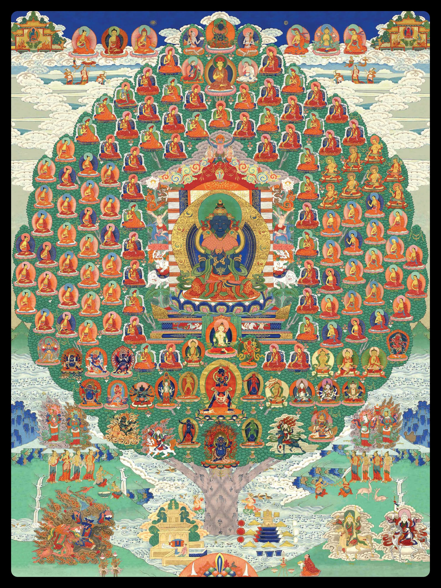

# Dharma
Principles and practices that uphold the natural and moral order of the universe from a Buddhist point of view.

# Ngondro Online Vajrasattva Retreat

> [1st Session in the Morning](#opening-1)  
[2nd, 3rd and 4th Sessions of the Day](#generating-bodhicitta)
[Contents](#contents)

## with Venerable Khenpo Tenzin

> The main obstacles that prevent all the extraordinary experiences and realizations of the profound path from arising are negative actions, obscurations, and habitual tendencies. Just as it is important to clean the surface of a mirror if forms are to be reflected in it, so too it is important to eliminate our obscurations so that realization can appear like a reflection in the mirror of the Ground of All. The Buddha taught countless methods of purification for this purpose, but the best of them all is meditation and recitation related to the teacher as Vajrasattva.   
> 
> ~ Patrul Rinpoche (1808-87)

### COMMITMENT / SAMAYA

The commitment you need to make in order to participant is to promise to do at minimum one session purely, with no distractions of any kind, every day starting from June 16 to October 4. Participants must commit to doing the entire retreat and watch the online class once a week for instruction. This retreat will be restricted for the participants and will not be accessible on our public YouTube channel.

Khenpo Tenzin recognizes that each person’s conditions will vary and some may work full time, part time, or be retired. However at minimum you will be required to do one session of practice everyday for the Vajrasattva ngondro retreat and work towards a total of 100,000 accumulations. Four sessions a day is traditional for a retreat and is best. Yet if you only have time to do 1, 2 or 3 sessions a day, that is also acceptable.

If you are unable to complete 100,000 recitations of the mantra by October 5, you may continue with your accumulations until you complete them. However you can only count mantras if you are seated for a formal session, not when you are doing other activities such as walking, etc. 

---

### PAGE TURNING INSTRUCTIONS for New Version of Tibetan, English and Chinese

For accumulation of Guru Yoga use of this text:  
*[A Practice of the Preliminaries of the Fivefold Mahamudra](.src/PaiYin_Ngondro-Sadhana_V26.17_藏英中_20231101-1.pdf)*

Pages 1 - 24 [Opening Prayers](#opening-1) (First session of each day only)  
Pages 35 - 41 [Vajrasattva Ngondro Practice](#the-excellent-path-to-enlightenment-a-practice-of-the-preliminaries-of-the-fivefold-path-of-mahāmudrā)  
Pages 77 - 98 [Closing Prayers](#closing-1) (Last session of each day only)  

### HOW TO NAVIGATE THE SADHANA FOR 4 SESSIONS:  

#### Opening:  
[1st Session in the Morning](#opening-1) - Pages 1 - 18  
[2nd, 3rd and 4th Sessions of the Day](#generating-bodhicitta) - Pages 16 - 24  

#### Practice:  
[Vajrasattva Ngondro Practice](#the-excellent-path-to-enlightenment-a-practice-of-the-preliminaries-of-the-fivefold-path-of-mahāmudrā) - Pages 35 - 41  

#### Closing:  
[Closing Prayers for Mid-Day Sessions](#closing-1) - Pages 77 - 80  
[Dedication Prayer for Mid-Day Sessions](#dedication-prayers) - Choose either page 85 or 86 or 87  
[Last Session of the Day](#closing-1) - Pages 77 - 98  

---

[Click here](https://www.youtube.com/live/OCSaBdCS_H8) for recorded livestream session on June 16 - week 1

[Click here](https://www.youtube.com/watch?v=eEnf0TM6J1s) for video 1 - week 1

Look into [reading this book](https://www.amnyitrulchung.org/teachings/materials/pdf/Gampopa%20-%20Jewel%20Ornament%20of%20Liberation%20-%20Complete.pdf)

# A PRACTICE OF THE PRELIMINARIES OF THE FIVEFOLD MAHAMUDRA

By The Garchen Buddhist Institute

---

Chenrezig King of Space

---

## Contents

- [Opening](#opening-1)
    - [Taking refuge and generating bodhicitta](#taking-refuge-and-generating-bodhicitta)
    - [The Four Immeasurable](#the-four-immeasurable)
    - [Supplication to Vajradhara's Lineage](#supplication-to-vajradhāras-lineage)
    - [Seven Limb Prayer](#seven-limb-prayer)
    - [The Sanskrit Vowels and Consonants](#the-sanskrit-vowels-and-consonants)
    - [Ye Dharma Mantra (The Essence of the Dependent Origination Mantra)](#ye-dharma-mantra-the-essence-of-the-dependent-origination-mantra)
    - [The Hundred Syllable Mantra](#the-hundred-syllable-mantra)
    - [Multiplying Mantras and Mala (Blessing) Mantra](#multiplying-mantras-and-mala-blessing-mantra)
        - [From the Ārya Parinata Chakra Sūtra](#from-the-ārya-parinata-chakra-sūtra)
        - [From the Selected Instructions by Atīśha](#from-the-selected-instructions-by-atīśha)
        - [From the Collection of Ten Million Sūtras](#from-the-collection-of-ten-million-sūtras)
        - [From the Dhāranī of the Inestimable Jeweled Mansion](#from-the-dhāranī-of-the-inestimable-jeweled-mansion)
        - [From the Sūtra of Gone Before the Lotus](#from-the-selected-instructions-by-atīśha)
    - [Om̆̇ āḥ hūm](#om̆̇-āḥ-hūm)

- [The Excellent Path to Enlightenment: A Practice of the Preliminaries of the Fivefold Path of Mahāmudrā](#the-excellent-path-to-enlightenment-a-practice-of-the-preliminaries-of-the-fivefold-path-of-mahāmudrā)
    - [Supplication To Guru](#supplication-to-guru)
    - [Generating Bodhicitta](#generating-bodhicitta)

- [1. The Four Common, Outer Preliminaries](#1-the-four-common-outer-preliminaries)
    - [1.1 The Difficulty of Finding a Precious Human Body](#11-the-difficulty-of-finding-a-precious-human-body)
    - [1.2 Death and Impermanence](#12-death-and-impermanence)
    - [1.3 The Shortcomings of Samsara](#13-the-shortcomings-of-samsara)
    - [1.4 Karma, Cause and Effect](#14-karma-cause-and-effect)

- [2. The Four Uncommon, Inner Preliminaries](#2-the-four-uncommon-inner-preliminaries)
    - [2.1 Taking Refuge in the Three Jewels](#21-taking-refuge-in-the-three-jewels)
    - [2.2 The Practice of Vajrasattva: the Method for Purifying Negativities and Obscurations](#22-the-practice-of-vajrasattva-the-method-for-purifying-negativities-and-obscurations)
    - [2.3 The Mandala Offering: the Method for Gathering the Two Accumulations](#23-the-mandala-offering-the-method-for-gathering-the-two-accumulations)
        - [2.3.1 Visualizing the Field of Accumulation](#231-visualizing-the-field-of-accumulation)
        - [2.3.2 The Thirty-Sevenfold Maṇḍala Offering](#232-the-thirty-sevenfold-maṇḍala-offering)
    - [2.4 The Practice of Guru Yoga to Instill Blessings in the Mind](#24-the-practice-of-guru-yoga-to-instill-blessings-in-the-mind)

- [3. The Special Preliminaries: Cultivating Love, Compassion and Bodhicitta](#3-the-special-preliminaries-cultivating-love-compassion-and-bodhicitta)
    - [3.1 First, Cultivating Love](#31-first-cultivating-love)
    - [3.2 Second, Cultivating Compassion](#32-second-cultivating-compassion)
    - [3.3 Third, Cultivating Bodhicitta](#33-third-cultivating-bodhicitta)

- [Closing](#closing-1)
    - [The Sanskrit Vowels and Consonants and The Essence of Dependency](#the-sanskrit-vowels-and-consonants-and-the-essence-of-dependency)
    - [Ye Dharma Mantra (The Essence of the Dependent Origination Mantra)](#ye-dharma-mantra-the-essence-of-the-dependent-origination-mantra-1)
    - [The Hundred Syllable Mantra](#the-hundred-syllable-mantra-1)
    - [Concluding Multiplying Mantras](#concluding-multiplying-mantras)
    - [The Short Prayer to be Reborn in Blissful Land of Amitabha](#the-short-prayer-to-be-reborn-in-blissful-land-of-amitabha)
    - [Dedication Prayers](#dedication-prayers)
    - [The Long Life Prayer for His Holiness the Dalai Lama](#the-long-life-prayer-for-his-holiness-the-dalai-lama)
    - [The Long Life Prayer for His Holiness Chetsang Rinpoche](#the-long-life-prayer-for-his-holiness-chetsang-rinpoche)
    - [The Long Life Prayer for His Holiness Chungtsang Rinpoche](#the-long-life-prayer-for-his-holiness-chungtsang-rinpoche)
    - [The Long Life Prayer for His Eminence Garchen Rinpoche](#the-long-life-prayer-for-his-eminence-garchen-rinpoche)
    - [A Praying for Generating Dri-Kung Sect Written by Mi-Pam](#a-praying-for-generating-dri-kung-sect-written-by-mi-pam)

## Opening

(Start of 1st session (<a href="https://www.dropbox.com/scl/fi/vdundow5orish1x12djs3/Preliminaries-Daily-1.mp3?rlkey=t7yzfh7y1dpdnks5euyv4wrhq&dl=0" target="_blank">short</a> and <a href="https://www.dropbox.com/scl/fi/jk9y6izrbwn65esb6zbfd/Preliminaries-Daily-1-long.mp3?rlkey=9gwev2vkfdwn38fec53spoozm&dl=0" target="_blank">long</a>))

### Taking Refuge and Generating Bodhicitta

(*Recite three times.*)

Until awakening, I take refuge in the Buddha, Dharma, and the Supreme Assembly! By the merit of generosity and other good deeds, may I attain buddhahood for the benefit of all beings!  
 
Until awakening, I take refuge in the Buddha, Dharma, and the Supreme Assembly! By the merit of generosity and other good deeds, may I attain buddhahood for the benefit of all beings!  
 
Until awakening, I take refuge in the Buddha, Dharma, and the Supreme Assembly! By the merit of generosity and other good deeds, may I attain buddhahood for the benefit of all beings!  

### The Four Immeasurable

(*Recite three times.*)  

May all mother sentient beings limitless as space have happiness and the causes of happiness![1](#1) May they be free from suffering and the causes of suffering![2](#2) May they not be separated from the happiness that is free from sorrow! May they rest in equanimity, free from attachment and aversion!  

May all mother sentient beings limitless as space have happiness and the causes of happiness![1](#1) May they be free from suffering and the causes of suffering![2](#2) May they not be separated from the happiness that is free from sorrow! May they rest in equanimity, free from attachment and aversion!   

May all mother sentient beings limitless as space have happiness and the causes of happiness![1](#1) May they be free from suffering and the causes of suffering![2](#2) May they not be separated from the happiness that is free from sorrow! May they rest in equanimity, free from attachment and aversion!  

Note 1
The cause of happiness is love.
  

Note 2
The cause of suffering is self-grasping.
 

### Supplication to Vajradhāra’s Lineage

To Great Vajradhāra, Tilopa, Nāropa, Marpa, Milarepa, Gampopa, Phagmo Drupa, and Lord Jigten Sumgön; to the feet of the root guru of threefold kindness; to all the  root and lineage gurus, the yidams, and Dharma protectors, I pray: please bless my mind-stream!  

### Seven-Limb Prayer

Whatever slight merit I have gathered through prostrating, offering, confessing, rejoicing, beseeching, and praying, I dedicate to the complete awakening of all beings!

### The Sanskrit Vowels and Consonants

om̆̇  
a ā  
i ī  
u ū  
ṛi ṛī  
ḷī   
e ai  
o au  
aṁ aḥ  
ka kha ga gha nga  
ca cha ja jha ña  
ṭa ṭha ḍa ḍha ṇa  
ta tha da dha na  
pa pha ba bha ma  
ya ra la va  
śa ṣa sa ha kṣaḥ  
svāhā  
audio [src](https://www.youtube.com/watch?v=9nnH5Jt3ikI)  

### Ye Dharma Mantra (The Essence of the Dependent Origination Mantra)

(*Recite three times.*) 

(*Using · between syllables for easier recitation*)

om̆̇ ye dhar·mā he·tu pra·bha·vā  
All dharmas originate from causes  
he·tuṃ te·ṣāṃ ta·thā·ga·ta hy·a·va·dat   
the tathagata has taught these causes,  
te·ṣāṃ ca yo ni·ro·dha  
and also that which puts a stop to these causes  
ev·aṃ vā·dī ma·hā śra·ma·ṇaḥ svā·hā  
this too has been taught by the Great Shramana.  

om̆̇ ye dhar·mā he·tu pra·bha·vā  
All dharmas originate from causes  
he·tuṃ te·ṣāṃ ta·thā·ga·ta hy·a·va·dat   
the tathagata has taught these causes,  
te·ṣāṃ ca yo ni·ro·dha  
and also that which puts a stop to these causes  
ev·aṃ vā·dī ma·hā śra·ma·ṇaḥ svā·hā  
this too has been taught by the Great Shramana. 

om̆̇ ye dhar·mā he·tu pra·bha·vā  
All dharmas originate from causes  
he·tuṃ te·ṣāṃ ta·thā·ga·ta hy·a·va·dat   
the tathagata has taught these causes,  
te·ṣāṃ ca yo ni·ro·dha  
and also that which puts a stop to these causes  
ev·aṃ vā·dī ma·hā śra·ma·ṇaḥ svā·hā  
this too has been taught by the Great Shramana.  
audio [src](https://www.youtube.com/watch?v=Pr7lZlDkRjQ), commentary [src](https://www.youtube.com/watch?v=iZ_VJ0bdc94)  

### The Hundred Syllable Mantra

(*Using · between syllables for easier recitation*)

oṃ     
Om is the supreme expression of praise.  
va·jra·satt·va sa·ma·ya ma·nu·pā·la·ya va·jra·satt·va  
Vajrasattva, ensure your samaya remains intact.  
tven·o·pa·tiṣ·ṭha dṛḍ·ho me bha·va  
Be steadfast in your care of me.   
su·to·ṣyo me bha·va  
Grant me unqualified contentment.  
su·po·ṣyo me bha·va  
Enhance everything that is noble within me.  
nur·ak·to me bha·va  
Look after me.  
sar·va·sidd·hiṃ me pray·acch·a  
Grant me all accomplishments,  
sar·va·kar·ma·su ca me  
And in everything I do  
citt·aṃ śrey·aḥ ku·ru  
Ensure my mind is virtuous.  
hūṃ  
The hūṃ syllable is Vajrasattva’s wisdom mind.  
ha ha ha ha  
These represent the four immeasurables, the four empowerments, the four joys, and the four kāyās.  
hoḥ  
What joy!  
bha·ga·van sar·va·tath·ā·ga·ta·va·jra  
Blessed One, who embodies all the tathāgatas, Vajra(sattva),  
mā me muñ·ca  
Never abandon me!  
va·jrī bha·va  
Grant me the realization of vajra nature!  
ma·hā·sa·ma·ya·satt·va  
Great samayasattva,  
āḥ  
I am one with you.  
audio [src](https://www.youtube.com/watch?v=uKy3zIoleCs), english [src](https://www.bodhicittasangha.org/100-syllable-mantra/)

### Multiplying Mantras and Mala (Blessing) Mantra

#### From the Ārya Parinata Chakra Sūtra

(*Recite seven times.*)

om̆̇ sambhara sambhara vimanasara mahā jambha hūm̆̇  
om̆̇ sambhara sambhara vimanasara mahā jambha hūm̆̇  
om̆̇ sambhara sambhara vimanasara mahā jambha hūm̆̇  
om̆̇ sambhara sambhara vimanasara mahā jambha hūm̆̇  
om̆̇ sambhara sambhara vimanasara mahā jambha hūm̆̇  
om̆̇ sambhara sambhara vimanasara mahā jambha hūm̆̇  
om̆̇ sambhara sambhara vimanasara mahā jambha hūm̆̇  

#### From the Selected Instructions by Atīśha

(*Recite seven times.*)

om̆̇ smara smara vimanaskara mahā jambha hūm̆̇ phaṭ  
om̆̇ smara smara vimanaskara mahā jambha hūm̆̇ phaṭ  
om̆̇ smara smara vimanaskara mahā jambha hūm̆̇ phaṭ  
om̆̇ smara smara vimanaskara mahā jambha hūm̆̇ phaṭ  
om̆̇ smara smara vimanaskara mahā jambha hūm̆̇ phaṭ  
om̆̇ smara smara vimanaskara mahā jambha hūm̆̇ phaṭ  
om̆̇ smara smara vimanaskara mahā jambha hūm̆̇ phaṭ  

#### From the Collection of Ten Million Sūtras

(*Recite seven times.*)

om̆̇ sambhara sambhara mahā jambhu hūm̆̇ phaṭ  
om̆̇ sambhara sambhara mahā jambhu hūm̆̇ phaṭ  
om̆̇ sambhara sambhara mahā jambhu hūm̆̇ phaṭ  
om̆̇ sambhara sambhara mahā jambhu hūm̆̇ phaṭ  
om̆̇ sambhara sambhara mahā jambhu hūm̆̇ phaṭ  
om̆̇ sambhara sambhara mahā jambhu hūm̆̇ phaṭ  
om̆̇ sambhara sambhara mahā jambhu hūm̆̇ phaṭ  

#### From the Dhāranī of the Inestimable Jeweled Mansion

(*Recite seven times.*)

om̆̇ ruciramaṇi pravartaya hūm̆̇ phaṭ  
om̆̇ ruciramaṇi pravartaya hūm̆̇ phaṭ  
om̆̇ ruciramaṇi pravartaya hūm̆̇ phaṭ  
om̆̇ ruciramaṇi pravartaya hūm̆̇ phaṭ  
om̆̇ ruciramaṇi pravartaya hūm̆̇ phaṭ  
om̆̇ ruciramaṇi pravartaya hūm̆̇ phaṭ  
om̆̇ ruciramaṇi pravartaya hūm̆̇ phaṭ  

### From the Sūtra of Gone Before the Lotus

(*Recite seven times and blow on the mālā.*)

om̆̇ hrīḥ padma nirti śhvari hūm  
om̆̇ hrīḥ padma nirti śhvari hūm  
om̆̇ hrīḥ padma nirti śhvari hūm  
om̆̇ hrīḥ padma nirti śhvari hūm  
om̆̇ hrīḥ padma nirti śhvari hūm  
om̆̇ hrīḥ padma nirti śhvari hūm  
om̆̇ hrīḥ padma nirti śhvari hūm  

### Om̆̇ āḥ hūm

(*Recite 108 times.*)

om̆̇ āḥ hūm  
om̆̇ āḥ hūm  
om̆̇ āḥ hūm  
om̆̇ āḥ hūm  
om̆̇ āḥ hūm  
om̆̇ āḥ hūm  
om̆̇ āḥ hūm  
om̆̇ āḥ hūm  
om̆̇ āḥ hūm  
om̆̇ āḥ hūm  
om̆̇ āḥ hūm  
om̆̇ āḥ hūm  
om̆̇ āḥ hūm  
om̆̇ āḥ hūm  
om̆̇ āḥ hūm  
om̆̇ āḥ hūm  
om̆̇ āḥ hūm  
om̆̇ āḥ hūm  
om̆̇ āḥ hūm  
om̆̇ āḥ hūm  
om̆̇ āḥ hūm  
om̆̇ āḥ hūm  
om̆̇ āḥ hūm  
om̆̇ āḥ hūm  
om̆̇ āḥ hūm  
om̆̇ āḥ hūm  
om̆̇ āḥ hūm  
om̆̇ āḥ hūm  
om̆̇ āḥ hūm  
om̆̇ āḥ hūm  
om̆̇ āḥ hūm  
om̆̇ āḥ hūm  
om̆̇ āḥ hūm  
om̆̇ āḥ hūm  
om̆̇ āḥ hūm  
om̆̇ āḥ hūm  
om̆̇ āḥ hūm  
om̆̇ āḥ hūm  
om̆̇ āḥ hūm  
om̆̇ āḥ hūm  
om̆̇ āḥ hūm  
om̆̇ āḥ hūm  
om̆̇ āḥ hūm  
om̆̇ āḥ hūm  
om̆̇ āḥ hūm  
om̆̇ āḥ hūm  
om̆̇ āḥ hūm  
om̆̇ āḥ hūm  
om̆̇ āḥ hūm  
om̆̇ āḥ hūm  
om̆̇ āḥ hūm  
om̆̇ āḥ hūm  
om̆̇ āḥ hūm  
om̆̇ āḥ hūm  
om̆̇ āḥ hūm  
om̆̇ āḥ hūm  
om̆̇ āḥ hūm  
om̆̇ āḥ hūm  
om̆̇ āḥ hūm  
om̆̇ āḥ hūm  
om̆̇ āḥ hūm  
om̆̇ āḥ hūm  
om̆̇ āḥ hūm  
om̆̇ āḥ hūm  
om̆̇ āḥ hūm  
om̆̇ āḥ hūm  
om̆̇ āḥ hūm  
om̆̇ āḥ hūm  
om̆̇ āḥ hūm  
om̆̇ āḥ hūm  
om̆̇ āḥ hūm  
om̆̇ āḥ hūm  
om̆̇ āḥ hūm  
om̆̇ āḥ hūm  
om̆̇ āḥ hūm  
om̆̇ āḥ hūm  
om̆̇ āḥ hūm  
om̆̇ āḥ hūm  
om̆̇ āḥ hūm  
om̆̇ āḥ hūm  
om̆̇ āḥ hūm  
om̆̇ āḥ hūm  
om̆̇ āḥ hūm  
om̆̇ āḥ hūm  
om̆̇ āḥ hūm  
om̆̇ āḥ hūm  
om̆̇ āḥ hūm  
om̆̇ āḥ hūm  
om̆̇ āḥ hūm  
om̆̇ āḥ hūm  
om̆̇ āḥ hūm  
om̆̇ āḥ hūm  
om̆̇ āḥ hūm  
om̆̇ āḥ hūm  
om̆̇ āḥ hūm  
om̆̇ āḥ hūm  
om̆̇ āḥ hūm  
om̆̇ āḥ hūm  
om̆̇ āḥ hūm  
om̆̇ āḥ hūm  
om̆̇ āḥ hūm  
om̆̇ āḥ hūm  
om̆̇ āḥ hūm  
om̆̇ āḥ hūm  
om̆̇ āḥ hūm  
om̆̇ āḥ hūm  
om̆̇ āḥ hūm  
om̆̇ āḥ hūm  
Wisdom, clarity, consciousness, body, inbreath  
Empty, spacious, openess, speech, in-between-breaths  
Union of openess and clarity, mind, exhale  
commentary [src](https://www.youtube.com/watch?v=WaAbelZnEtM), audio [src](https://www.youtube.com/watch?v=BA7LXjESK2I)

## The Excellent Path to Enlightenment: A Practice of the Preliminaries of the Fivefold Path of Mahāmudrā

In order to practice the common (outer), the uncommon (inner), and the special preliminaries, seated on a comfortable cushion, assume the essential points[3](#3) of body, speech, and mind. Think that your root guru, who embodies all buddhas, sits above your crown and looks upon you with great love.

Note 3
The essential points of the body allude to the physical posture optimal for meditation, mostly referring to the sevenfold posture of Vairocana. The essential point of the speech refers to the ninefold expelling of stale breath to purify the winds. The essential point of the mind is to engender an altruistic intent of bodhicitta.
 

### Supplication To Guru 

(*Recite three times.*)

Guru, please think of me!  
Guru, please think of me!  
Guru, please think of me!

Essence of all Buddhas of the three times; source of the holy Dharma of scripture and realization; master of the Sangha, the noble assembly; root guru, please think of me!

Great treasure of compassion and blessing, source of two siddhis, your enlightened activities grant every wish—root guru, please think of me!

Kind root guru, please think of me! Look upon me from the place of great bliss at the crown of my head! Let me see the face of dharmakāya—my natural awareness—and bring me to the state of buddhahood in this very life!

(*Recite extraction from Calling the Gurus from Afar by Jamgon Kongtrül Rinpoche*)

Alas! Sentient beings, like myself, marred by sins and evil karma...

### Generating Bodhicitta

(Start of sessions (<a href="https://www.dropbox.com/scl/fi/8i6bongn6beclg8senou5/Preliminaries-Daily-2.mp3?rlkey=8r5y0vyjuhdzk9l02lk0ubn2q&dl=0" target="_blank">2</a>, <a href="https://www.dropbox.com/scl/fi/dor2b88b022n3jbrgyomv/Preliminaries-Daily-3.mp3?rlkey=6s1fo6mhzl2rpxhv30iv0af0x&dl=0" target="_blank">3</a>, and <a href="https://www.dropbox.com/scl/fi/wk3oj36et7ld2el21edfy/Preliminaries-Daily-4.mp3?rlkey=dybeta9n6ckuowyh3o8f03nmb&dl=0" target="_blank">4</a>))

(*Recite three times*)

All mother sentient beings, limitless as space—especially those enemies who hate me, obstructers who harm me, and those who create obstacles on my path to liberation and omniscience—may they experience happiness; be free from suffering; and swiftly may they attain precious, unsurpassed perfectly complete enlightenment!  

All mother sentient beings, limitless as space—especially those enemies who hate me, obstructers who harm me, and those who create obstacles on my path to liberation and omniscience—may they experience happiness; be free from suffering; and swiftly may they attain precious, unsurpassed perfectly complete enlightenment!  

All mother sentient beings, limitless as space—especially those enemies who hate me, obstructers who harm me, and those who create obstacles on my path to liberation and omniscience—may they experience happiness; be free from suffering; and swiftly may they attain precious, unsurpassed perfectly complete enlightenment!  

For that purpose, until I attain buddhahood, I will apply my body, speech, and mind to virtue. 

Until death, I will apply my body, speech, and mind to virtue. 

From today until this time tomorrow, I will apply my body, speech, and mind to virtue.

## 1. The Four Common, Outer Preliminaries
### 1.1 The Difficulty of Finding a Precious Human Body

Unless a true wish for liberation arises within you, your practice will not turn toward the Dharma. It will only turn toward the Dharma if you have a pure intention of renouncing saṃsāra. Therefore, reflect upon the freedoms and advantages of this precious human body that is so difficult to find, as an antidote to the deep-seated attachment to this life.

Now that I have found this excellent support of freedom and advantage, which in the future, will be difficult to find again, I must practice to attain the state of unsurpassed awakening in order to fulfill the benefit of others.

### 1.2 Death and Impermanence

As an antidote to sloth and laziness, reflect on the impermanence of life:

Since the demonic Lord of Death is the enemy that hates my precious body, death is certain, but its timing is unknown. Therefore, I must recognize my own impermanence and that of others.

### 1.3 The Shortcomings of Samsara

As an antidote to the belief that true happiness can be found within saṃsāric existence, reflect on the suffering of saṃsāra.

Wherever I am born in the realms of saṃsāra, I have no chance at finding [true] wellbeing. Therefore, without concern for worldly pleasures, I enter the path of nirvāṇa.

### 1.4 Karma, Cause and Effect

To make meaningful use of this body of freedom and advantage, reflect on karma, cause and effect.

To make this life of freedom and advantage meaningful, I renounce the three poisonous emotions and unwholesome deeds. I will exert myself in virtuous actions and will protect the samaya and vows of the three doors.

[**Go to Vjarasattva practice -->**](#22-the-practice-of-vajrasattva-the-method-for-purifying-negativities-and-obscurations)  

## 2. The Four Uncommon, Inner Preliminaries

 
Of the four uncommon preliminaries, first, in order to be taken under the protection of the Three Jewels, one takes refuge. Since taking refuge is the entrance door to Buddhism, the benefits of taking refuge in the Three Jewels with fully trusting faith, free from any doubts, are inconceivable. The Condensed Perfection of Wisdom says, “If the merit of taking refuge had material form, even the three worlds would be too small to contain it.” The White Lotus Sūtra says, “Lay or ordained, those who have entered my teachings will, in this very fortunate eon, attain complete nirvāṇa without residue.” 

---

---

 

### 2.1 Taking Refuge in the Three Jewels

 
Visualize the places of refuge with the intention of taking refuge in the Three Jewels for
the purpose of freeing all sentient beings, limitless as space, from saṃsāra, the ocean of
suffering.

In the space before me, in the center of a wish-granting tree that emerges from a lake, on a precious throne that sits beneath a lotus and moon, is the Guru, Vajradhāra—the presiding master of all buddha families—surrounded by the ocean of accomplished Kagyü masters. In front is the Blessed Lord Chakrasaṃvara together with a host of yidam deities of the four and six classes of tantra. To his right are the buddhas of the three times, endowed with the major and minor marks, together with the thousand buddhas of this Fortunate Eon. Behind is the Great Mother of Transcendent Wisdom and
volumes of sūtras and tantras, naturally echoing the sound of Dharma. To his left are the bodhisattva-protectors of the three families, surrounded by the assembly of the Three Vehicles’
noble Sangha. Surrounding everything are oceans of oath-bound protectors, gathering like billowing clouds.

Go for refuge thinking that “from now onwards, until attaining awakening, I and all limitless sentient beings take refuge and prostrate with respectful body, speech, and mind to the places of refuge visualized in front of me in this way”.

Namo! In the Buddha: dharmakāya, guru, and empty essence; in the Dharma: saṃbhogakāya, yidam, and clear nature; and in the Sangha: nirmāṇakāya, ḍākinī, and all-pervasive compassion, I take refuge until attaining awakening!

Through your blessings, may the minds of myself and all sentient beings, limitless as space, turn toward the Dharma! Through your blessings, may my Dharma become the path! Through your blessings, may the path dispel confusion! Through your blessings, may confused appearances arise as primordial wisdom!

By supplicating thus with intense devotion, the field of accumulation melts into the nature of five-colored lights, which then dissolve into you. Thus, imagine that your mind-stream is blessed, and rest for a while in the natural state without reference point

 

### 2.2 The Practice of Vajrasattva: the Method for Purifying Negativities and Obscurations

 
Negativities, obscurations, and karmic imprints hinder the realization of the profound meaning of Dharma. Therefore, it is necessary to purify one’s obscurations, just as it is necessary to wipe a mirror in order for a reflection to appear. It is said, “Though negativities themselves have no good qualities, the benefit of negativities is that they can be purified if confessed.” Thus, no matter how grave your negativities and obscurations are, if you confess them properly, they must become purified. Although there are many ways to confess, the supreme method is the meditation and recitation of Vajrasattva. The Stainless Confession Tantra says, “Vajrasattva himself has promised that the negativities and obscurations of someone who recites the Hundred Syllable Mantra, which is the essence of all the sugatas of the three times, will become completely purified.” Therefore,
engage in the practice properly.

  

Above the crown of my head, on a seat of lotus and moon, is a brilliant white hūm̆̇ . The hūm̆̇ emanates rays of light into the ten directions and makes delightful offerings to the buddhas and
bodhisattvas, and having gathered their wisdom, love, and power, the light dissolves back into the hūm̆̇. Again, the hūm̆̇ emanates rays of light to the abodes of the six classes of beings, purifying
their karmic perceptions, self-grasping, and habitual tendencies. The light gathers back, and the hūm̆̇ transforms into the Guru Vajrasattva—the presiding master of all buddha families. His
complexion is white and clear, and he is endowed with the ornaments of a saṃbhogakāya. In his right hand, close to his heart, he holds a vajra of empty awareness and in his left hand, beside his hip, a bell of empty appearance. He sits with his legs crossed in half-[vajra] posture, appearing clearly in a vast rainbow-sphere.

O Glorious Vajrasattva—myself and all limitless sentient beings, please purify and cleanse our ignorance, self-grasping, and karmic imprints.

Having supplicated thus, a stream of bodhicitta nectar emerges from the seed syllable and mantra garland at Vajrasattva’s heart. [The nectar] fills up his entire body, enters the Brahma opening at my crown, and purifies all my negativities and obscurations.

(*Recite the Hundred-Syllable Mantra.*)

(*Using · between syllables for easier recitation*)

oṃ     
Om is the supreme expression of praise.  
va·jra·satt·va sa·ma·ya ma·nu·pā·la·ya va·jra·satt·va  
Vajrasattva, ensure your samaya remains intact.  
tven·o·pa·tiṣ·ṭha dṛḍ·ho me bha·va  
Be steadfast in your care of me.   
su·to·ṣyo me bha·va  
Grant me unqualified contentment.  
su·po·ṣyo me bha·va  
Enhance everything that is noble within me.  
nur·ak·to me bha·va  
Look after me.  
sar·va·sidd·hiṃ me pray·acch·a  
Grant me all accomplishments,  
sar·va·kar·ma·su ca me  
And in everything I do  
citt·aṃ śrey·aḥ ku·ru  
Ensure my mind is virtuous.  
hūṃ  
The hūṃ syllable is Vajrasattva’s wisdom mind.  
ha ha ha ha  
These represent the four immeasurables, the four empowerments, the four joys, and the four kāyās.  
hoḥ  
What joy!  
bha·ga·van sar·va·tath·ā·ga·ta·va·jra  
Blessed One, who embodies all the tathāgatas, Vajra(sattva),  
mā me muñ·ca  
Never abandon me!  
va·jrī bha·va  
Grant me the realization of vajra nature!  
ma·hā·sa·ma·ya·satt·va  
Great samayasattva,  
āḥ  
I am one with you.  
audio [src](https://www.youtube.com/watch?v=uKy3zIoleCs), english [src](https://www.bodhicittasangha.org/100-syllable-mantra/)

In the darkness of ignorance, I have gone astray and breached samaya. Guru, protector, please give me refuge! Chief vajra holder, nature of great compassion, lord of all beings, I take refuge in you!

To this supplication, Vajrasattva responds, “O child of noble family, all your negativities, obscurations, faults, and downfalls are cleansed.” Giving pardon, he [melts into light and] dissolves
into me indivisibly. 

Having contemplated thus, even the notion of a deity dissolves into a state of luminous, natural awareness. Rest briefly in this state of beholding Vajrasattva’s actual face: the empty awareness, in which all concepts of something to be purified and someone who purifies lack inherent existence.

[**Go to closing practice -->**](#closing-1)

### 2.3 The Mandala Offering: the Method for Gathering the Two Accumulations

A sūtra says, “As long as one has not truly completed the two accumulations, one will not truly realize emptiness.” Furthermore, “The ultimate, innate wisdom is the mark that testifies to one having gathered the accumulations and purified obscurations.” Thus, it is crucial to gather the accumulations. While there are many methods for gathering the accumulations, the maṇḍala offering is supreme. A tantra says, “Through offering the entire billionfold universe, adorned with various desirable qualities, to all the buddhas in their pure realms, buddha wisdom is accomplished.” Thus, be diligent in the maṇḍala offering.

#### 2.3.1 Visualizing the Field of Accumulation

In the space before me, in the center of a wish-granting tree that emerges from a lake, on a precious throne that sits beneath a lotus and moon, is Great Vajradhāra—the presiding master of all buddha families—surrounded by the ocean of accomplished Kagyü masters. In front is the Blessed Lord Chakrasaṃvara together with a host of yidam deities of the four and six classes of tantra. To his right are the buddhas of the three times, endowed with the major and minor marks, together with the thousand buddhas of this Fortunate Eon. Behind is the Great Mother of Transcendent Wisdom and volumes of sūtras and tantras, naturally echoing the sound of Dharma. To his left are the bodhisattva-protectors of the three families surrounded by the noble Sangha of Bodhisattvas. Surrounding everything are oceans of oath-bound protectors, gathering like billowing clouds.

In the presence of this visualized merit-field, think that you offer yourself, everything you own, the universe and all beings, and all the glories and riches of gods and humans.

#### 2.3.2 The Thirty-Sevenfold Maṇḍala Offering

Om̆̇ vajra bhumi ā hūm̆̇. The completely pure base is a golden ground[4](#4) full of power. Om̆̇ vajra reke ā hūm̆̇. It is surrounded by a circle of iron mountains. At its center is hūm̆̇, the king of mountains, Sumeru. In the east is Excellent Body[5](#5); in the south, the land of the Jambu Tree[6](#6); in the west, Wish-Fulfilling Cattle[7](#7); in the north, Voice of Doom[8](#8); toward[9](#9) the east, Body and Noble Body; toward the south, Tail Fan and Minor Tail Fan; toward the west, Tremulous and Great Destiny; toward the north, Voice of Doom and Satellite of Voice of Doom. There is also the mountain of jewels, the wish-granting tree, the wish-granting cow, the harvest that needs no toil, the precious wheel, the precious gem, the precious queen, the precious minister, the precious elephant, the precious supreme steed, the precious general, the great treasure vase, the goddess of beauty, the goddess of garlands, the goddess of song, the goddess of dance, the goddess of flowers, the goddess of incense, the goddess of light, the goddess of perfume, the sun, the moon, a precious parasol, and a banner of universal victory. In the center are the most exalted glories and riches of gods and humans, without exception. I offer this field of utter purity to the gurus, yidams, buddhas, bodhisattvas, ḍākas, ḍākinīs, and Dharma protectors. Please accept it with compassion for the benefit of beings. Having accepted it, please grant your blessings!

Note 4
The maṇḍala is a symbolic representation of the universe. The universe is said to sit on a golden ground, at the center of which is Mount Meru. The world-systems orbit this cosmic mountain.
  

Note 5
Pūrvavideha is the world that lies in the east, where people have very special looks. The world is extremely vast and wonderful. The land is in oval in shape, as are the faces of the inhabitants.
  

Note 6
Jambudvīpa or the world of the Rose-Apple Tree is the world of human beings. People here have rich humanity, and are able to tell good from evil, right from wrong. The land is oblate spheroid, and so is human face.
  

Note 7
Aparagodānīya is the world that lies in the west, where people live off of cow markets and cow selling. There are many cows, goats, and valuable treasures. The land and people’s faces both look like the full moon.
  

Note 8
Uttarakurū is the world that lies in the north. It is a place that is better than the other three worlds. People here are very casual and free from worries. The land is square in shape, and human faces are similar to this.
  

Note 9
Each of these planets is accompanied by two smaller planets.
   

An infinite array of worlds, each with four continents and the wealth of infinite oceans of realms—if I bring them all to mind and offer them without exception, please hold with compassion all the beings they contain! My body, enjoyments, and whatever I own—my aggregates, elements, and sense sources; my aspirations now and in times to come; as well as everything I grasp as “mine”—by offering them all, may I be blessed with the end of self-grasping! Completely liberated from the bounds of real and unreal—transcending the names and attributes of arising, cessation, and abiding; coming and going; affirmation and denial—the supreme maṇḍala is the natural state. By offering it, may I be blessed to attain the state of buddhahood!

om̆̇ guru deva ḍākinī ratna maṇḍala pratīccha svāhā

Thus offer.

All owned and unowned things of the infinite, billionfold universe in its totality, my own body, enjoyments, and all my possessions, I offer—holding nothing back—to the ocean of the rare and precious ones. May the self-grasping of all beings be thereby fully pacified! May all beings be endowed with bodhicitta, and may they instantly attain the state of buddhahood! 

This verse is to be accumulated.

To the assembly of gurus with three kāyas perfectly complete, I make outer, inner, secret, and suchness offerings. Please accept this offering of my body, wealth, and all appearance and existence, and bestow the unsurpassed, supreme accomplishment!

At the end of this recitation, the field of accumulation dissolves into you. The fundamental nature of the one who offers, the recipient of the offering, and the offering itself transcend all names and characteristics. Rest briefly within this unaltered state of mahāmudrā—
the ultimate maṇḍala, which is the natural state.

### 2.4 The Practice of Guru Yoga to Instill Blessings in the Mind

The only way to realize the natural state of Mahamudra is through a devotion that sees the guru as the Buddha and from the power of blessings received from that guru. In a sūtra it says, “The ultimate truth is realized through faith.” In a tantra it says, “Better than meditating on a hundred-thousand deities for ten million eons is to think of the guru for a single moment.” Lord Jigten Sumgön said, “Unless the sun of devotion shines upon the snow mountain of the guru’s four kāyas, the stream of blessings will not emerge. Therefore, apply your mind assiduously in the practice of devotion.” As mentioned here and in various other sources, one should be diligent in the practice of Guru Yoga, as it causes the guru’s blessings to enter one’s mind.

In the space before me, on a seat of lotus and moon, sits my root guru—the embodiment of all places of refuge—appearing in the form of Great Vajradhāra: the glory of all saṃsāra and nirvāṇa. Blue and adorned with precious ornaments, he holds a vajra and bell crossed at the heart, and his legs are crossed in vajra posture. He is surrounded by the Golden Garland of the Kagyü Lineage[10](#10), who embody wisdom, love, and power and who spread through space like massing clouds. Contemplate thus, and then make offerings.

Note 10
The Golden Garland refers to the early masters of the Kagyü lineage.
 

Glorious guru, lord of four kāyas, I offer my body, speech, mind, and all of material existence as offering substances of outer, inner, and other nature. The one who offers, the recipient, and the offering itself have one single nature—unconfined and of one taste. As I make offerings, please bestow the effortless accomplishment. Supplicate with deep-felt devotion:

To Great Vajradhāra, Tilopa, Nāropa, Marpa, Milarepa, Gampopa, Phagmodrupa, Lord Jigten Sumgön, root guru of threefold kindness[11](#11)—to all the root and lineage gurus—I pray: Through your blessings, may self-grasping leave my mind. Bless me to develop loving-kindness and compassion! Through your blessings, may I realize the natural state of selflessness! Bless me to reach buddhahood in this very life! Thus, supplicate earnestly from your heart.

Note 11
This refers to the root guru who is kind to us in three ways: through bestowing empowerment, explaining the tantras, and giving essential instructions.
 

Root guru, who embodies all the buddhas, I pray to you with a single-minded, longing heart! Then, from the four places of the guru’s body, four-colored light rays emanate and dissolve into my own four places. In this way, I receive the four
empowerments; the four obscurations are purified, one by one; and I actualize the four kāyas. Then, the guru dissolves into me, and I evenly rest in an inseparable state.

Thus, having merged your mind indivisibly with the guru’s mind, rest within a non-referential state. In all circumstances throughout the post-meditative state, it is important to sustain recognition that the nature of your own mindful awareness is the guru. Je Götsangpa said, “Guru Yoga is to recognize your own mind. The nature of supplication is to sustain undistracted mindfulness. The guru is nowhere outside, but rather, he is indivisible from your own mind. Practice Guru Yoga in this way.” Thus, recognize that, ultimately, the actual guru is indivisibly united with your own mind.

## 3. The Special Preliminaries: Cultivating Love, Compassion and Bodhicitta
### 3.1 First, Cultivating Love

The enjoyment of bliss and happiness of all mother sentient beings, limitless as space, is caused by a wish to benefit others. Therefore, may the minds of all be filled with love!

Having recited this, think about your mother, who cared for you with great kindness in four different ways, such as looking after you affectionately. Then consider how all other sentient beings have cared for you with just such kindness when they were your mothers in previous lives. Reflect upon this thought until you have developed love—the uncontrived mind that wishes that all sentient beings may have happiness and the cause of happiness, which is love.

### 3.2 Second, Cultivating Compassion

The intolerable suffering that torments mother sentient beings, who are limitless as space, in the six realms of saṃsāra, is caused by the ignorance of grasping at a self. May it be fully pacified, and may all beings care for others with altruistic compassion!

Having recited this, bring to mind the intense suffering of sentient beings, imagining them as your own mother. A feeling of unbearable compassion will certainly arise. Then, consider that even though they are not your mothers in this present life, they all have surely been your mothers in previous lives. So, thinking that all these sentient beings that are tormented by suffering have been your mothers, exert yourself in cultivating great compassion—the wish that they all be free from suffering and the cause of suffering, which is self-grasping

### 3.3 Third, Cultivating Bodhicitta

Committing to the result is aspiring bodhicitta, and committing to the cause is engaging bodhicitta. Whether one takes the vows of aspiring and engaging bodhicitta according to the elaborate system of the Great Awakening of Bodhicitta or the concise ritual of taking them oneself, it is essential to understand the training that is to be undertaken.

For countless lifetimes, mother sentient beings have been tormented by great evil, suffering, and pain due to having taken birth for their own sakes. To free them from the ocean of existence, I shall enter the supreme path of enlightenment.

Repeat this many times and gain an actual experience of compassion and bodhicitta within your mind. In all your daily activities, never separate from the wish to do whatever you can to bring benefit and happiness to all sentient beings. Within such practice, all precepts of the bodhisattva vow are included, and everything you do will become a practice of the six pāramitās. The benefits of bodhicitta are endless. The Avataṃsaka Sūtra states, “All the buddhas of the three times ultimately arise from the excellent, pure mind of bodhicitta—the treasure trove of merit. All the happiness of worldly beings arises from it. All goodness extolled by the victorious ones arises from it. It consumes the obscurations of all worlds. Without a doubt, it is through bodhicitta that one will become foremost among the victorious ones.” Furthermore, Lord Jigten Sumgön says in the Gongchik, “The Buddha is an embodiment of bodhicitta.” If bodhicitta is present, one cannot help but attain awakening. If it is absent, no matter what other practices, generation and completion stages, and so forth, one engages in, they will amount to nothing more than a facade. Therefore, as the three special preliminaries are the essence of all paths, practice them sincerely until they have taken birth within your mind-stream.

Thinking that it would benefit many devoted and dedicated disciples to have a Ngöndro Sādhana of appropriate length, Dorzin Könchok Döndrup requested His Eminence Garchen Rinpoche to compose this text, supporting his request by offering a white katak scarf with the auspicious symbols printed on it and a hundred dollars. Moreover, several devotees from inside Tibet requested the composition of this text with great insistence. Thinking that it might be of benefit to his Dharma friends, who can see gold in a clod of dirt [humbly referring to Himself], the 8th Garchen Rinpoche, Könchok Gyaltsen, compiled this text in accordance with the structure of Dharmakīrti’s Oral Instructions on the Preliminaries of the Fivefold Path [of Mahāmudrā], while also including some lines taken from the instructions of other learned and accomplished masters of the past. This text was completed at the Garchen Buddhist Institute in the United States. The disciple Thubten Nima assisted, acting as Rinpoche’s scribe.

## Closing
### The Sanskrit Vowels and Consonants and The Essence of Dependency

om̆̇  
a ā  
i ī  
u ū  
ṛi ṛī  
ḷi ḷī   
e ai  
o au  
aṁ aḥ  
ka kha ga gha nga  
ca cha ja jha ña  
ṭa ṭha ḍa ḍha ṇa  
ta tha da dha na  
pa pha ba bha ma  
ya ra la va  
śa ṣa sa ha kṣaḥ  
svāhā  
audio [src](https://www.youtube.com/watch?v=9nnH5Jt3ikI)   

### Ye Dharma Mantra (The Essence of the Dependent Origination Mantra)

(*Recite three times.*) 

(*Using · between syllables for easier recitation*)

om̆̇ ye dhar·mā he·tu pra·bha·vā  
All dharmas originate from causes  
he·tuṃ te·ṣāṃ ta·thā·ga·ta hy·a·va·dat   
the tathagata has taught these causes,  
te·ṣāṃ ca yo ni·ro·dha  
and also that which puts a stop to these causes  
ev·aṃ vā·dī ma·hā śra·ma·ṇaḥ svā·hā  
this too has been taught by the Great Shramana.  

om̆̇ ye dhar·mā he·tu pra·bha·vā  
All dharmas originate from causes  
he·tuṃ te·ṣāṃ ta·thā·ga·ta hy·a·va·dat   
the tathagata has taught these causes,  
te·ṣāṃ ca yo ni·ro·dha  
and also that which puts a stop to these causes  
ev·aṃ vā·dī ma·hā śra·ma·ṇaḥ svā·hā  
this too has been taught by the Great Shramana. 

om̆̇ ye dhar·mā he·tu pra·bha·vā  
All dharmas originate from causes  
he·tuṃ te·ṣāṃ ta·thā·ga·ta hy·a·va·dat   
the tathagata has taught these causes,  
te·ṣāṃ ca yo ni·ro·dha  
and also that which puts a stop to these causes  
ev·aṃ vā·dī ma·hā śra·ma·ṇaḥ svā·hā  
this too has been taught by the Great Shramana.  
audio [src](https://www.youtube.com/watch?v=Pr7lZlDkRjQ), commentary [src](https://www.youtube.com/watch?v=iZ_VJ0bdc94)

### The Hundred Syllable Mantra*

(*Recite twenty five times.*) 

* "Since this is a Vajrasattva practice, the 100,000 accumulation will be for the Hundred Syllable Mantra." - MW

(*Using · between syllables for easier recitation*)

oṃ     
Om is the supreme expression of praise.  
va·jra·satt·va sa·ma·ya ma·nu·pā·la·ya va·jra·satt·va  
Vajrasattva, ensure your samaya remains intact.  
tven·o·pa·tiṣ·ṭha dṛḍ·ho me bha·va  
Be steadfast in your care of me.   
su·to·ṣyo me bha·va  
Grant me unqualified contentment.  
su·po·ṣyo me bha·va  
Enhance everything that is noble within me.  
nur·ak·to me bha·va  
Look after me.  
sar·va·sidd·hiṃ me pray·acch·a  
Grant me all accomplishments,  
sar·va·kar·ma·su ca me  
And in everything I do  
citt·aṃ śrey·aḥ ku·ru  
Ensure my mind is virtuous.  
hūṃ  
The hūṃ syllable is Vajrasattva’s wisdom mind.  
ha ha ha ha  
These represent the four immeasurables, the four empowerments, the four joys, and the four kāyās.  
hoḥ  
What joy!  
bha·ga·van sar·va·tath·ā·ga·ta·va·jra  
Blessed One, who embodies all the tathāgatas, Vajra(sattva),  
mā me muñ·ca  
Never abandon me!  
va·jrī bha·va  
Grant me the realization of vajra nature!  
ma·hā·sa·ma·ya·satt·va  
Great samayasattva,  
āḥ  
I am one with you.  
audio [src](https://www.youtube.com/watch?v=uKy3zIoleCs), english [src](https://www.bodhicittasangha.org/100-syllable-mantra/)

### Concluding Multiplying Mantras

tadyathā pañcandriya āwa bodhanāye svāhā

om̆̇ ru ru dharu mukhe mukhe svāhā

(*Recite 7 times.*)

om̆̇ hanubhaśha bhara hridaya svāhā  
om̆̇ hanubhaśha bhara hridaya svāhā  
om̆̇ hanubhaśha bhara hridaya svāhā  
om̆̇ hanubhaśha bhara hridaya svāhā  
om̆̇ hanubhaśha bhara hridaya svāhā  
om̆̇ hanubhaśha bhara hridaya svāhā  
om̆̇ hanubhaśha bhara hridaya svāhā  

(*Recite 108 times.*)

om̆̇ āḥ hūm  
om̆̇ āḥ hūm  
om̆̇ āḥ hūm  
om̆̇ āḥ hūm  
om̆̇ āḥ hūm  
om̆̇ āḥ hūm  
om̆̇ āḥ hūm  
om̆̇ āḥ hūm  
om̆̇ āḥ hūm  
om̆̇ āḥ hūm  
om̆̇ āḥ hūm  
om̆̇ āḥ hūm  
om̆̇ āḥ hūm  
om̆̇ āḥ hūm  
om̆̇ āḥ hūm  
om̆̇ āḥ hūm  
om̆̇ āḥ hūm  
om̆̇ āḥ hūm  
om̆̇ āḥ hūm  
om̆̇ āḥ hūm  
om̆̇ āḥ hūm  
om̆̇ āḥ hūm  
om̆̇ āḥ hūm  
om̆̇ āḥ hūm  
om̆̇ āḥ hūm  
om̆̇ āḥ hūm  
om̆̇ āḥ hūm  
om̆̇ āḥ hūm  
om̆̇ āḥ hūm  
om̆̇ āḥ hūm  
om̆̇ āḥ hūm  
om̆̇ āḥ hūm  
om̆̇ āḥ hūm  
om̆̇ āḥ hūm  
om̆̇ āḥ hūm  
om̆̇ āḥ hūm  
om̆̇ āḥ hūm  
om̆̇ āḥ hūm  
om̆̇ āḥ hūm  
om̆̇ āḥ hūm  
om̆̇ āḥ hūm  
om̆̇ āḥ hūm  
om̆̇ āḥ hūm  
om̆̇ āḥ hūm  
om̆̇ āḥ hūm  
om̆̇ āḥ hūm  
om̆̇ āḥ hūm  
om̆̇ āḥ hūm  
om̆̇ āḥ hūm  
om̆̇ āḥ hūm  
om̆̇ āḥ hūm  
om̆̇ āḥ hūm  
om̆̇ āḥ hūm  
om̆̇ āḥ hūm  
om̆̇ āḥ hūm  
om̆̇ āḥ hūm  
om̆̇ āḥ hūm  
om̆̇ āḥ hūm  
om̆̇ āḥ hūm  
om̆̇ āḥ hūm  
om̆̇ āḥ hūm  
om̆̇ āḥ hūm  
om̆̇ āḥ hūm  
om̆̇ āḥ hūm  
om̆̇ āḥ hūm  
om̆̇ āḥ hūm  
om̆̇ āḥ hūm  
om̆̇ āḥ hūm  
om̆̇ āḥ hūm  
om̆̇ āḥ hūm  
om̆̇ āḥ hūm  
om̆̇ āḥ hūm  
om̆̇ āḥ hūm  
om̆̇ āḥ hūm  
om̆̇ āḥ hūm  
om̆̇ āḥ hūm  
om̆̇ āḥ hūm  
om̆̇ āḥ hūm  
om̆̇ āḥ hūm  
om̆̇ āḥ hūm  
om̆̇ āḥ hūm  
om̆̇ āḥ hūm  
om̆̇ āḥ hūm  
om̆̇ āḥ hūm  
om̆̇ āḥ hūm  
om̆̇ āḥ hūm  
om̆̇ āḥ hūm  
om̆̇ āḥ hūm  
om̆̇ āḥ hūm  
om̆̇ āḥ hūm  
om̆̇ āḥ hūm  
om̆̇ āḥ hūm  
om̆̇ āḥ hūm  
om̆̇ āḥ hūm  
om̆̇ āḥ hūm  
om̆̇ āḥ hūm  
om̆̇ āḥ hūm  
om̆̇ āḥ hūm  
om̆̇ āḥ hūm  
om̆̇ āḥ hūm  
om̆̇ āḥ hūm  
om̆̇ āḥ hūm  
om̆̇ āḥ hūm  
om̆̇ āḥ hūm  
om̆̇ āḥ hūm  
om̆̇ āḥ hūm  
om̆̇ āḥ hūm  
om̆̇ āḥ hūm  
Wisdom, clarity, consciousness, body, inbreath  
Empty, spacious, openess, speech, in-between-breaths  
Union of openess and clarity, mind, exhale  
commentary [src](https://www.youtube.com/watch?v=WaAbelZnEtM), audio [src](https://www.youtube.com/watch?v=BA7LXjESK2I)

[**Go to Dedication - all daily practices except the last -->**](#dedication-prayers)

### The Short Prayer to be Reborn in Blissful Land of Amitabha

Emaho! In the center is the wondrous Buddha Amitābha of Boundless Light. To his right is Chenrezig, the Lord of Great Compassion, and to his left is Vajrapāṇi, the Bodhisattva of Great Power. They are surrounded by buddhas and bodhisattvas, inconceivable in number—limitless peace and happiness is the pure land of Great Bliss. As soon as I and others pass from this life, may we—unhindered by another saṃsāric birth—be born there and see the face of Amitābha, Boundless Light! May the buddhas and bodhisattvas of the ten directions bless this aspiration that it may be accomplished without hindrance!

tadyathā pañcandriya āwa bodhanāye svāhā

### Dedication Prayers

May bodhicitta, the precious and supreme mind, arise in whom it has not yet arisen! Where it has arisen, may it not decline, but ever increase higher and higher!

*(1st)* By this merit may I obtain omniscience or [at least] defeat the enemies—my wrongdoings—may I liberate all beings who are tossed in the ocean of saṃsāra by the waves of birth, old age, sickness, and death!

*(2nd)* Just as the hero Mañjushrī realized things as they are and as did Samantabhadra too, I will follow in their path by perfectly dedicating all of these virtues!

*(3rd)* By the blessing of the buddhas who attained the three kāyas, by the blessing of the truth of the unchanging nature of reality, and by the blessing of the undivided Sangha community, may my aspirations be fulfilled according to this dedication prayer!

By the virtues collected in the three times by myself and all beings in saṃsāra and nirvāṇa, and by the intrinsic root of virtue, may I and all sentient beings quickly attain unsurpassed, perfect, complete, and precious awakening!

### The Long Life Prayer for His Holiness the Dalai Lama

For this realm encircled by snow-covered mountains, you are the source of all benefit and happiness without exception. Tenzin Gyatso, Lord Chenrezig, may you remain steadfast until the end of saṃsāra!

### The Long Life Prayer for His Holiness Chetsang Rinpoche

Embodiment of the Three Jewels, great being who upholds and increases the teachings of the Śhākya Lion, supreme are your activities of guiding others with your perfect deeds. May you, the precious guru, who accomplishes everything spontaneously, live long!

### The Long Life Prayer for His Holiness Chungtsang Rinpoche

Holder of the teachings of Lord Drikungpa, great lord of the Three Jewels, through the power of your peerless compassion
and the holy Dharma’s peace and light, you bring relief to beings. May your life be long!

### The Long Life Prayer for His Eminence Garchen Rinpoche

The one known in the Noble Land as Āryadeva, emanated into the Gar clan of Eastern Tibet as Chödingpa, the heart son of Jigten Gönpo—may the life of glorious Garchen remain steadfast for a hundred aeons!

In this degenerate age, when the Buddha’s teaching fades away, through his powerful, vajra-like conduct, he takes on himself the heavy responsibility of the unbiased teaching. May Garchen, the Sun of the Teaching, live long!

I pray for the excellent health of the guru! I pray that he lives a supremely long life! I pray that his activities spread far and wide! Grant blessings that I may not be separate from my guru!

In all the activities of the glorious guru, may wrong views not arise within me for even a moment, and through devotion that sees whatever he does as perfect, may the guru’s blessings enter my mind!

May all sentient beings have happiness, and may all the lower realms be permanently emptied! May the aspirations made by bodhisattvas of all bhūmis be accomplished!

### A Praying for Generating Dri-Kung Sect Written by Mi-Pam

May the teaching of the great Drikungpa Ratnaśhrī—Master of Interdependence, Omniscient Lord of Dharma, who has seen all knowable things—be upheld until the end of existence. May it be taught and accomplished through hearing, reflecting, and meditating!

May the Doctrine, only remedy for suffering, The source of every bliss and happiness, Be nurtured and upheld with reverence, And throughout a vast continuance of time, endure!

Noble Lady White Tārā

om̆̇ tāre tuttāre ture mama āyur jñāna  
puṇye puṣṭīṃ kuru svāhā  
Om̆̇ , O Tara, swift liberator from suffering, make my  
lifespan, wisdom and merit increase, svāhā  

Garchen Buddhist Institute  
P.O. Box 4318  
9995 E. Blissful Path  
Chino Valley, AZ 86323  
928-925-1237  
[www.garchen.net](https://garchen.net)  

