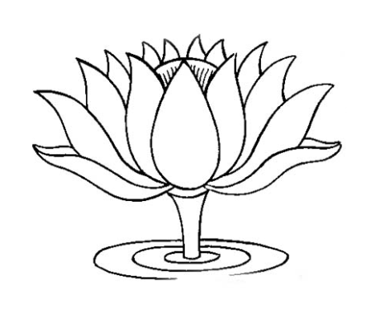
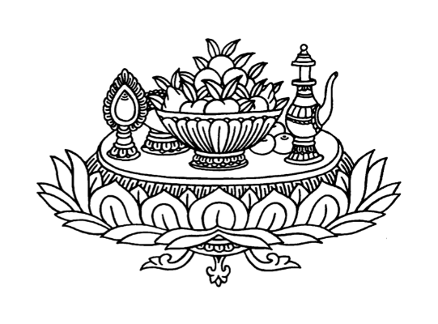
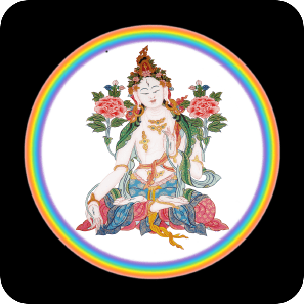
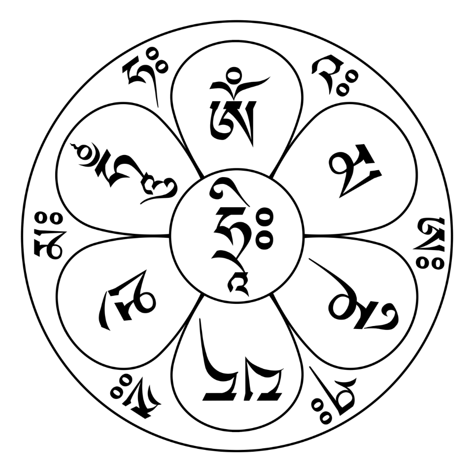

[Dharma](/README.md) > 

# DO NOT ACCESS WITHOUT PERMISSION

# Mandala Offerings Ngondro Online Retreat

Announcement

 
Guru Yoga  
Online Ngondro Retreat  
with Venerable Khenpo Tenzin  
November 30 - December 28  

Dear Ngondro Participants,  
Please do not share any links or zoom credentials with other practitioners who have not signed up for the class. Thank you. We are delighted that you all will engage in the powerful practice of Guru Yoga. Venerable Khenpo Tenzin will teach all sessions of this Guru Yoga Ngondro program LIVE instead of via pre-recorded videos. On a weekly basis, participants must commit to watching/participating in the LIVE session, or watching the replay.  

VIDEO SESSIONS  

<a href="https://www.youtube.com/watch?v=PRL1biAHYV8">Click here</a> for recorded livestream session from November 30 - week 1  

The remaining sessions will be from 9 am to 11 am MST on the following dates:  

COMMITMENT / SAMAYA  

The commitment you need to make in order to participate is to promise to do at minimum one session purely, with no distractions of any kind, every day starting from November 30th. Participants must commit to doing the entire retreat and watching the online class once a week for instruction. This retreat will be restricted to the participants and will not be accessible on our public YouTube channel.  

Khenpo Tenzin recognizes that each person’s conditions will vary and some may work full time, part time, or be retired. However at minimum you will be required to do one session of practice everyday and work towards a total of 100,000 accumulations. Four sessions a day is traditional for a retreat and is best. Yet if you only have time to do 1, 2 or 3 sessions a day, that is also acceptable.  

If you are unable to complete 100,000 accumulations of the mandala portion by December 28th, you may continue with your accumulations until you complete them. However you can only count repetitions if you are seated for a formal session, not when you are doing any other activities.  

For accumulation of Guru Yoga use of this Text:  

A Practice of the Preliminaries of the Fivefold Mahamudra  

Page 1 - 24 Opening Prayers (First session of each day only)  

Page 60 - 68 Guru Yoga Prayer Recitation  

Page 77 - 98 Closing Prayers (Last session of each day only)  

HOW TO NAVIGATE THE SADHANA FOR 4 SESSIONS:  

1st morning session - start with page 1 - 18  

2nd, 3rd and 4th sessions - start with page 16 - 24  

Prayer Recitation - page 60 - 68  

End of each session - page 77 - 80  

Dedication for day sessions - page 84 or 85 or 86 - you choose.  

Last evening session - page 77 - 98

## Opening

<a href="https://www.dropbox.com/scl/fi/kmgon8mf895sfz1nwxvit/guru-yoga.mp3" target="_blank">Guided meditation</a>

### Taking Refuge and Generating Bodhicitta

(*Recite three times.*)

Until awakening, I take refuge in the Buddha, Dharma, and the Supreme Assembly! By the merit of generosity and other good deeds, may I attain buddhahood for the benefit of all beings!  
 
Until awakening, I take refuge in the Buddha, Dharma, and the Supreme Assembly! By the merit of generosity and other good deeds, may I attain buddhahood for the benefit of all beings!  
 
Until awakening, I take refuge in the Buddha, Dharma, and the Supreme Assembly! By the merit of generosity and other good deeds, may I attain buddhahood for the benefit of all beings!  

### The Four Immeasurable

(*Recite three times.*)  

May all mother sentient beings limitless as space have happiness and the causes of happiness![1](#1) May they be free from suffering and the causes of suffering![2](#2) May they not be separated from the happiness that is free from sorrow! May they rest in equanimity, free from attachment and aversion!  

May all mother sentient beings limitless as space have happiness and the causes of happiness![1](#1) May they be free from suffering and the causes of suffering![2](#2) May they not be separated from the happiness that is free from sorrow! May they rest in equanimity, free from attachment and aversion!   

May all mother sentient beings limitless as space have happiness and the causes of happiness![1](#1) May they be free from suffering and the causes of suffering![2](#2) May they not be separated from the happiness that is free from sorrow! May they rest in equanimity, free from attachment and aversion!  

Note 1
The cause of happiness is love.
  

Note 2
The cause of suffering is self-grasping.
 

### Supplication to Vajradhāra’s Lineage

To Great Vajradhāra, Tilopa, Nāropa, Marpa, Milarepa, Gampopa, Phagmo Drupa, and Lord Jigten Sumgön; to the feet of the root guru of threefold kindness; to all the  root and lineage gurus, the yidams, and Dharma protectors, I pray: please bless my mind-stream!  

### Seven-Limb Prayer

Whatever slight merit I have gathered through prostrating, offering, confessing, rejoicing, beseeching, and praying, I dedicate to the complete awakening of all beings!

### The Sanskrit Vowels and Consonants

om̆̇  
a ā  
i ī  
u ū  
ṛi ṛī  
ḷī   
e ai  
o au  
aṁ aḥ  
ka kha ga gha nga  
ca cha ja jha ña  
ṭa ṭha ḍa ḍha ṇa  
ta tha da dha na  
pa pha ba bha ma  
ya ra la va  
śa ṣa sa ha kṣaḥ  
svāhā  
audio [src](https://www.youtube.com/watch?v=9nnH5Jt3ikI)  

### Ye Dharma Mantra (The Essence of the Dependent Origination Mantra)

(*Recite three times.*) 

(*Using · between syllables for easier recitation*)

om̆̇ ye dhar·mā he·tu pra·bha·vā  
All dharmas originate from causes  
he·tuṃ te·ṣāṃ ta·thā·ga·ta hy·a·va·dat   
the tathagata has taught these causes,  
te·ṣāṃ ca yo ni·ro·dha  
and also that which puts a stop to these causes  
ev·aṃ vā·dī ma·hā śra·ma·ṇaḥ svā·hā  
this too has been taught by the Great Shramana.  

om̆̇ ye dhar·mā he·tu pra·bha·vā  
All dharmas originate from causes  
he·tuṃ te·ṣāṃ ta·thā·ga·ta hy·a·va·dat   
the tathagata has taught these causes,  
te·ṣāṃ ca yo ni·ro·dha  
and also that which puts a stop to these causes  
ev·aṃ vā·dī ma·hā śra·ma·ṇaḥ svā·hā  
this too has been taught by the Great Shramana. 

om̆̇ ye dhar·mā he·tu pra·bha·vā  
All dharmas originate from causes  
he·tuṃ te·ṣāṃ ta·thā·ga·ta hy·a·va·dat   
the tathagata has taught these causes,  
te·ṣāṃ ca yo ni·ro·dha  
and also that which puts a stop to these causes  
ev·aṃ vā·dī ma·hā śra·ma·ṇaḥ svā·hā  
this too has been taught by the Great Shramana.  
audio [src](https://www.youtube.com/watch?v=Pr7lZlDkRjQ), commentary [src](https://www.youtube.com/watch?v=iZ_VJ0bdc94)  

### The Hundred Syllable Mantra

(*Using · between syllables for easier recitation*)

oṃ     
Om is the supreme expression of praise.  
va·jra·satt·va sa·ma·ya ma·nu·pā·la·ya va·jra·satt·va  
Vajrasattva, ensure your samaya remains intact.  
tven·o·pa·tiṣ·ṭha dṛḍ·ho me bha·va  
Be steadfast in your care of me.   
su·to·ṣyo me bha·va  
Grant me unqualified contentment.  
su·po·ṣyo me bha·va  
Enhance everything that is noble within me.  
anur·ak·to me bha·va  
Look after me.  
sar·va·sidd·hiṃ me pray·acch·a  
Grant me all accomplishments,  
sar·va·kar·ma·su ca me  
And in everything I do  
citt·aṃ śrey·aḥ ku·ru  
Ensure my mind is virtuous.  
hūṃ  
The hūṃ syllable is Vajrasattva’s wisdom mind.  
ha ha ha ha  
These represent the four immeasurables, the four empowerments, the four joys, and the four kāyās.  
hoḥ  
What joy!  
bha·ga·van sar·va·tath·ā·ga·ta·va·jra  
Blessed One, who embodies all the tathāgatas, Vajra(sattva),  
mā me muñ·ca  
Never abandon me!  
va·jrī bha·va  
Grant me the realization of vajra nature!  
ma·hā·sa·ma·ya·satt·va  
Great samayasattva,  
āḥ  
I am one with you.  
audio [src](https://www.youtube.com/watch?v=uKy3zIoleCs), english [src](https://www.bodhicittasangha.org/100-syllable-mantra/)

### Multiplying Mantras and Mala (Blessing) Mantra

#### From the Ārya Parinata Chakra Sūtra

(*Recite seven times.*)

om̆̇ sambhara sambhara vimanasara mahā jambha hūm̆̇  
om̆̇ sambhara sambhara vimanasara mahā jambha hūm̆̇  
om̆̇ sambhara sambhara vimanasara mahā jambha hūm̆̇  
om̆̇ sambhara sambhara vimanasara mahā jambha hūm̆̇  
om̆̇ sambhara sambhara vimanasara mahā jambha hūm̆̇  
om̆̇ sambhara sambhara vimanasara mahā jambha hūm̆̇  
om̆̇ sambhara sambhara vimanasara mahā jambha hūm̆̇  

#### From the Selected Instructions by Atīśha

(*Recite seven times.*)

om̆̇ smara smara vimanaskara mahā jambha hūm̆̇ phaṭ  
om̆̇ smara smara vimanaskara mahā jambha hūm̆̇ phaṭ  
om̆̇ smara smara vimanaskara mahā jambha hūm̆̇ phaṭ  
om̆̇ smara smara vimanaskara mahā jambha hūm̆̇ phaṭ  
om̆̇ smara smara vimanaskara mahā jambha hūm̆̇ phaṭ  
om̆̇ smara smara vimanaskara mahā jambha hūm̆̇ phaṭ  
om̆̇ smara smara vimanaskara mahā jambha hūm̆̇ phaṭ  

#### From the Collection of Ten Million Sūtras

(*Recite seven times.*)

om̆̇ sambhara sambhara mahā jambhu hūm̆̇ phaṭ  
om̆̇ sambhara sambhara mahā jambhu hūm̆̇ phaṭ  
om̆̇ sambhara sambhara mahā jambhu hūm̆̇ phaṭ  
om̆̇ sambhara sambhara mahā jambhu hūm̆̇ phaṭ  
om̆̇ sambhara sambhara mahā jambhu hūm̆̇ phaṭ  
om̆̇ sambhara sambhara mahā jambhu hūm̆̇ phaṭ  
om̆̇ sambhara sambhara mahā jambhu hūm̆̇ phaṭ  

#### From the Dhāranī of the Inestimable Jeweled Mansion

(*Recite seven times.*)

om̆̇ ruciramaṇi pravartaya hūm̆̇ phaṭ  
om̆̇ ruciramaṇi pravartaya hūm̆̇ phaṭ  
om̆̇ ruciramaṇi pravartaya hūm̆̇ phaṭ  
om̆̇ ruciramaṇi pravartaya hūm̆̇ phaṭ  
om̆̇ ruciramaṇi pravartaya hūm̆̇ phaṭ  
om̆̇ ruciramaṇi pravartaya hūm̆̇ phaṭ  
om̆̇ ruciramaṇi pravartaya hūm̆̇ phaṭ  

### From the Sūtra of Gone Before the Lotus

(*Recite seven times and blow on the mālā.*)

om̆̇ hrīḥ padma nirti śhvari hūm  
om̆̇ hrīḥ padma nirti śhvari hūm  
om̆̇ hrīḥ padma nirti śhvari hūm  
om̆̇ hrīḥ padma nirti śhvari hūm  
om̆̇ hrīḥ padma nirti śhvari hūm  
om̆̇ hrīḥ padma nirti śhvari hūm  
om̆̇ hrīḥ padma nirti śhvari hūm  

### Om̆̇ āḥ hūm

(*Recite 108 times.*)

om̆̇ āḥ hūm  
om̆̇ āḥ hūm  
om̆̇ āḥ hūm  
om̆̇ āḥ hūm  
om̆̇ āḥ hūm  
om̆̇ āḥ hūm  
om̆̇ āḥ hūm  
om̆̇ āḥ hūm  
om̆̇ āḥ hūm  
om̆̇ āḥ hūm  
om̆̇ āḥ hūm  
om̆̇ āḥ hūm  
om̆̇ āḥ hūm  
om̆̇ āḥ hūm  
om̆̇ āḥ hūm  
om̆̇ āḥ hūm  
om̆̇ āḥ hūm  
om̆̇ āḥ hūm  
om̆̇ āḥ hūm  
om̆̇ āḥ hūm  
om̆̇ āḥ hūm  
om̆̇ āḥ hūm  
om̆̇ āḥ hūm  
om̆̇ āḥ hūm  
om̆̇ āḥ hūm  
om̆̇ āḥ hūm  
om̆̇ āḥ hūm  
om̆̇ āḥ hūm  
om̆̇ āḥ hūm  
om̆̇ āḥ hūm  
om̆̇ āḥ hūm  
om̆̇ āḥ hūm  
om̆̇ āḥ hūm  
om̆̇ āḥ hūm  
om̆̇ āḥ hūm  
om̆̇ āḥ hūm  
om̆̇ āḥ hūm  
om̆̇ āḥ hūm  
om̆̇ āḥ hūm  
om̆̇ āḥ hūm  
om̆̇ āḥ hūm  
om̆̇ āḥ hūm  
om̆̇ āḥ hūm  
om̆̇ āḥ hūm  
om̆̇ āḥ hūm  
om̆̇ āḥ hūm  
om̆̇ āḥ hūm  
om̆̇ āḥ hūm  
om̆̇ āḥ hūm  
om̆̇ āḥ hūm  
om̆̇ āḥ hūm  
om̆̇ āḥ hūm  
om̆̇ āḥ hūm  
om̆̇ āḥ hūm  
om̆̇ āḥ hūm  
om̆̇ āḥ hūm  
om̆̇ āḥ hūm  
om̆̇ āḥ hūm  
om̆̇ āḥ hūm  
om̆̇ āḥ hūm  
om̆̇ āḥ hūm  
om̆̇ āḥ hūm  
om̆̇ āḥ hūm  
om̆̇ āḥ hūm  
om̆̇ āḥ hūm  
om̆̇ āḥ hūm  
om̆̇ āḥ hūm  
om̆̇ āḥ hūm  
om̆̇ āḥ hūm  
om̆̇ āḥ hūm  
om̆̇ āḥ hūm  
om̆̇ āḥ hūm  
om̆̇ āḥ hūm  
om̆̇ āḥ hūm  
om̆̇ āḥ hūm  
om̆̇ āḥ hūm  
om̆̇ āḥ hūm  
om̆̇ āḥ hūm  
om̆̇ āḥ hūm  
om̆̇ āḥ hūm  
om̆̇ āḥ hūm  
om̆̇ āḥ hūm  
om̆̇ āḥ hūm  
om̆̇ āḥ hūm  
om̆̇ āḥ hūm  
om̆̇ āḥ hūm  
om̆̇ āḥ hūm  
om̆̇ āḥ hūm  
om̆̇ āḥ hūm  
om̆̇ āḥ hūm  
om̆̇ āḥ hūm  
om̆̇ āḥ hūm  
om̆̇ āḥ hūm  
om̆̇ āḥ hūm  
om̆̇ āḥ hūm  
om̆̇ āḥ hūm  
om̆̇ āḥ hūm  
om̆̇ āḥ hūm  
om̆̇ āḥ hūm  
om̆̇ āḥ hūm  
om̆̇ āḥ hūm  
om̆̇ āḥ hūm  
om̆̇ āḥ hūm  
om̆̇ āḥ hūm  
om̆̇ āḥ hūm  
om̆̇ āḥ hūm  
om̆̇ āḥ hūm  
om̆̇ āḥ hūm  
Wisdom, clarity, consciousness, body, inbreath  
Empty, spacious, openess, speech, in-between-breaths  
Union of openess and clarity, mind, exhale  
commentary [src](https://www.youtube.com/watch?v=WaAbelZnEtM), audio [src](https://www.youtube.com/watch?v=BA7LXjESK2I)

## The Excellent Path to Enlightenment: A Practice of the Preliminaries of the Fivefold Path of Mahāmudrā

In order to practice the common (outer), the uncommon (inner), and the special preliminaries, seated on a comfortable cushion, assume the essential points[3](#3) of body, speech, and mind. Think that your root guru, who embodies all buddhas, sits above your crown and looks upon you with great love.

Note 3
The essential points of the body allude to the physical posture optimal for meditation, mostly referring to the sevenfold posture of Vairocana. The essential point of the speech refers to the ninefold expelling of stale breath to purify the winds. The essential point of the mind is to engender an altruistic intent of bodhicitta.
 

### Supplication To Guru 

(*Recite three times.*)

Guru, please think of me!  
Guru, please think of me!  
Guru, please think of me!

Essence of all Buddhas of the three times; source of the holy Dharma of scripture and realization; master of the Sangha, the noble assembly; root guru, please think of me!

Great treasure of compassion and blessing, source of two siddhis, your enlightened activities grant every wish—root guru, please think of me!

Kind root guru, please think of me! Look upon me from the place of great bliss at the crown of my head! Let me see the face of dharmakāya—my natural awareness—and bring me to the state of buddhahood in this very life!

(*Recite extraction from Calling the Gurus from Afar by Jamgon Kongtrül Rinpoche*)

Alas! Sentient beings, like myself, marred by sins and evil karma...

### Generating Bodhicitta

(Start of sessions <a href="https://www.dropbox.com/scl/fi/8i6bongn6beclg8senou5/Preliminaries-Daily-2.mp3?rlkey=8r5y0vyjuhdzk9l02lk0ubn2q&dl=0" target="_blank">2</a>, <a href="https://www.dropbox.com/scl/fi/dor2b88b022n3jbrgyomv/Preliminaries-Daily-3.mp3?rlkey=6s1fo6mhzl2rpxhv30iv0af0x&dl=0" target="_blank">3</a>, and <a href="https://www.dropbox.com/scl/fi/wk3oj36et7ld2el21edfy/Preliminaries-Daily-4.mp3?rlkey=dybeta9n6ckuowyh3o8f03nmb&dl=0" target="_blank">4</a>)

(*Recite three times*)

All mother sentient beings, limitless as space—especially those enemies who hate me, obstructers who harm me, and those who create obstacles on my path to liberation and omniscience—may they experience happiness; be free from suffering; and swiftly may they attain precious, unsurpassed perfectly complete enlightenment!  

All mother sentient beings, limitless as space—especially those enemies who hate me, obstructers who harm me, and those who create obstacles on my path to liberation and omniscience—may they experience happiness; be free from suffering; and swiftly may they attain precious, unsurpassed perfectly complete enlightenment!  

All mother sentient beings, limitless as space—especially those enemies who hate me, obstructers who harm me, and those who create obstacles on my path to liberation and omniscience—may they experience happiness; be free from suffering; and swiftly may they attain precious, unsurpassed perfectly complete enlightenment!  

For that purpose, until I attain buddhahood, I will apply my body, speech, and mind to virtue. 

Until death, I will apply my body, speech, and mind to virtue. 

From today until this time tomorrow, I will apply my body, speech, and mind to virtue.

## 1. The Four Common, Outer Preliminaries
### 1.1 The Difficulty of Finding a Precious Human Body

Unless a true wish for liberation arises within you, your practice will not turn toward the Dharma. It will only turn toward the Dharma if you have a pure intention of renouncing saṃsāra. Therefore, reflect upon the freedoms and advantages of this precious human body that is so difficult to find, as an antidote to the deep-seated attachment to this life.

Now that I have found this excellent support of freedom and advantage, which in the future, will be difficult to find again, I must practice to attain the state of unsurpassed awakening in order to fulfill the benefit of others.

### 1.2 Death and Impermanence

As an antidote to sloth and laziness, reflect on the impermanence of life:

Since the demonic Lord of Death is the enemy that hates my precious body, death is certain, but its timing is unknown. Therefore, I must recognize my own impermanence and that of others.

### 1.3 The Shortcomings of Samsara

As an antidote to the belief that true happiness can be found within saṃsāric existence, reflect on the suffering of saṃsāra.

Wherever I am born in the realms of saṃsāra, I have no chance at finding [true] wellbeing. Therefore, without concern for worldly pleasures, I enter the path of nirvāṇa.

### 1.4 Karma, Cause and Effect

To make meaningful use of this body of freedom and advantage, reflect on karma, cause and effect.

To make this life of freedom and advantage meaningful, I renounce the three poisonous emotions and unwholesome deeds. I will exert myself in virtuous actions and will protect the samaya and vows of the three doors.

### 2.4 The Practice of Guru Yoga to Instill Blessings in the

The only way to realize the natural state of Mahamudra is through a devotion that sees
the guru as the Buddha and from the power of blessings received from that guru. In a
sūtra it says, “The ultimate truth is realized through faith.” In a tantra it says, “Better
than meditating on a hundred-thousand deities for ten million eons is to think of the guru
for a single moment.” Lord Jigten Sumgön said, “Unless the sun of devotion shines upon
the snow mountain of the guru’s four kāyas, the stream of blessings will not emerge.
Therefore, apply your mind assiduously in the practice of devotion.” As mentioned here
and in various other sources, one should be diligent in the practice of Guru Yoga, as it
causes the guru’s blessings to enter one’s mind.

In the space before me, on a seat of lotus and moon, sits my root
guru—the embodiment of all places of refuge—appearing in the
form of Great Vajradhāra: the glory of all saṃsāra and nirvāṇa.
Blue and adorned with precious ornaments, he holds a vajra and
bell crossed at the heart, and his legs are crossed in [vajra]
posture. He is surrounded by the Golden Garland of the Kagyü
Lineage,8 who embody wisdom, love, and power and who spread
through space like massing clouds.
Contemplate thus, and [then] make offerings.  

Glorious guru, lord of four kāyas, I offer my body, speech, mind,
and all of material existence as offering substances of outer,
inner, and other nature. The one who offers, the recipient, and
the offering itself have one single nature—unconfined and of
one taste. As I make offerings, please bestow the effortless
accomplishment. Supplicate with deep-felt devotion:  

To Great Vajradhāra, Tilopa, Nāropa, Marpa, Milarepa,
Gampopa, Phagmodrupa, Lord Jigten Sumgön, root guru of
threefold kindness9—to all the root and lineage gurus—I pray:
Through your blessings, may self-grasping leave my mind. Bless
me to develop loving-kindness and compassion! Through your
blessings, may I realize the natural state of selflessness! Bless me
to reach buddhahood in this very life! Thus, supplicate earnestly from
your heart.  

Root guru, who embodies all the buddhas, I pray to you with a
single-minded, longing heart! Then, from the four places of the
guru’s body, four-colored light rays emanate and dissolve into
my own four places. In this way, I receive the four
empowerments; the four obscurations are purified, one by one;
and I actualize the four kāyas. Then, the guru dissolves into me,
and I evenly rest in an inseparable state.  

Thus, having merged your mind indivisibly with the guru’s mind, rest within a nonreferential
state. In all circumstances throughout the post-meditative state, it is important
to sustain recognition that the nature of your own mindful awareness is the guru.
Je Götsangpa said, “Guru Yoga is to recognize your own mind. The nature of supplication
is to sustain undistracted mindfulness. The guru is nowhere outside, but rather, he is
indivisible from your own mind. Practice Guru Yoga in this way.” Thus, recognize that,
ultimately, the actual guru is indivisibly united with your own mind.  

## Closing
### The Sanskrit Vowels and Consonants and The Essence of Dependency

om̆̇  
a ā  
i ī  
u ū  
ṛi ṛī  
ḷi ḷī   
e ai  
o au  
aṁ aḥ  
ka kha ga gha nga  
ca cha ja jha ña  
ṭa ṭha ḍa ḍha ṇa  
ta tha da dha na  
pa pha ba bha ma  
ya ra la va  
śa ṣa sa ha kṣaḥ  
svāhā  
audio [src](https://www.youtube.com/watch?v=9nnH5Jt3ikI)   

### Ye Dharma Mantra (The Essence of the Dependent Origination Mantra)

(*Recite three times.*) 

(*Using · between syllables for easier recitation*)

om̆̇ ye dhar·mā he·tu pra·bha·vā  
All dharmas originate from causes  
he·tuṃ te·ṣāṃ ta·thā·ga·ta hy·a·va·dat   
the tathagata has taught these causes,  
te·ṣāṃ ca yo ni·ro·dha  
and also that which puts a stop to these causes  
ev·aṃ vā·dī ma·hā śra·ma·ṇaḥ svā·hā  
this too has been taught by the Great Shramana.  

om̆̇ ye dhar·mā he·tu pra·bha·vā  
All dharmas originate from causes  
he·tuṃ te·ṣāṃ ta·thā·ga·ta hy·a·va·dat   
the tathagata has taught these causes,  
te·ṣāṃ ca yo ni·ro·dha  
and also that which puts a stop to these causes  
ev·aṃ vā·dī ma·hā śra·ma·ṇaḥ svā·hā  
this too has been taught by the Great Shramana. 

om̆̇ ye dhar·mā he·tu pra·bha·vā  
All dharmas originate from causes  
he·tuṃ te·ṣāṃ ta·thā·ga·ta hy·a·va·dat   
the tathagata has taught these causes,  
te·ṣāṃ ca yo ni·ro·dha  
and also that which puts a stop to these causes  
ev·aṃ vā·dī ma·hā śra·ma·ṇaḥ svā·hā  
this too has been taught by the Great Shramana.  
audio [src](https://www.youtube.com/watch?v=Pr7lZlDkRjQ), commentary [src](https://www.youtube.com/watch?v=iZ_VJ0bdc94)

### The Hundred Syllable Mantra*

(*Using · between syllables for easier recitation*)

oṃ     
Om is the supreme expression of praise.  
va·jra·satt·va sa·ma·ya ma·nu·pā·la·ya va·jra·satt·va  
Vajrasattva, ensure your samaya remains intact.  
tven·o·pa·tiṣ·ṭha dṛḍ·ho me bha·va  
Be steadfast in your care of me.   
su·to·ṣyo me bha·va  
Grant me unqualified contentment.  
su·po·ṣyo me bha·va  
Enhance everything that is noble within me.  
anur·ak·to me bha·va  
Look after me.  
sar·va·sidd·hiṃ me pray·acch·a  
Grant me all accomplishments,  
sar·va·kar·ma·su ca me  
And in everything I do  
citt·aṃ śrey·aḥ ku·ru  
Ensure my mind is virtuous.  
hūṃ  
The hūṃ syllable is Vajrasattva’s wisdom mind.  
ha ha ha ha  
These represent the four immeasurables, the four empowerments, the four joys, and the four kāyās.  
hoḥ  
What joy!  
bha·ga·van sar·va·tath·ā·ga·ta·va·jra  
Blessed One, who embodies all the tathāgatas, Vajra(sattva),  
mā me muñ·ca  
Never abandon me!  
va·jrī bha·va  
Grant me the realization of vajra nature!  
ma·hā·sa·ma·ya·satt·va  
Great samayasattva,  
āḥ  
I am one with you.  
audio [src](https://www.youtube.com/watch?v=uKy3zIoleCs), english [src](https://www.bodhicittasangha.org/100-syllable-mantra/)

### Concluding Multiplying Mantras

tadyathā pañcandriya āwa bodhanāye svāhā

om̆̇ ru ru dharu mukhe mukhe svāhā

(*Recite 7 times.*)

om̆̇ hanubhaśha bhara hridaya svāhā  
om̆̇ hanubhaśha bhara hridaya svāhā  
om̆̇ hanubhaśha bhara hridaya svāhā  
om̆̇ hanubhaśha bhara hridaya svāhā  
om̆̇ hanubhaśha bhara hridaya svāhā  
om̆̇ hanubhaśha bhara hridaya svāhā  
om̆̇ hanubhaśha bhara hridaya svāhā  

(*Recite 108 times.*)

om̆̇ āḥ hūm  
om̆̇ āḥ hūm  
om̆̇ āḥ hūm  
om̆̇ āḥ hūm  
om̆̇ āḥ hūm  
om̆̇ āḥ hūm  
om̆̇ āḥ hūm  
om̆̇ āḥ hūm  
om̆̇ āḥ hūm  
om̆̇ āḥ hūm  
om̆̇ āḥ hūm  
om̆̇ āḥ hūm  
om̆̇ āḥ hūm  
om̆̇ āḥ hūm  
om̆̇ āḥ hūm  
om̆̇ āḥ hūm  
om̆̇ āḥ hūm  
om̆̇ āḥ hūm  
om̆̇ āḥ hūm  
om̆̇ āḥ hūm  
om̆̇ āḥ hūm  
om̆̇ āḥ hūm  
om̆̇ āḥ hūm  
om̆̇ āḥ hūm  
om̆̇ āḥ hūm  
om̆̇ āḥ hūm  
om̆̇ āḥ hūm  
om̆̇ āḥ hūm  
om̆̇ āḥ hūm  
om̆̇ āḥ hūm  
om̆̇ āḥ hūm  
om̆̇ āḥ hūm  
om̆̇ āḥ hūm  
om̆̇ āḥ hūm  
om̆̇ āḥ hūm  
om̆̇ āḥ hūm  
om̆̇ āḥ hūm  
om̆̇ āḥ hūm  
om̆̇ āḥ hūm  
om̆̇ āḥ hūm  
om̆̇ āḥ hūm  
om̆̇ āḥ hūm  
om̆̇ āḥ hūm  
om̆̇ āḥ hūm  
om̆̇ āḥ hūm  
om̆̇ āḥ hūm  
om̆̇ āḥ hūm  
om̆̇ āḥ hūm  
om̆̇ āḥ hūm  
om̆̇ āḥ hūm  
om̆̇ āḥ hūm  
om̆̇ āḥ hūm  
om̆̇ āḥ hūm  
om̆̇ āḥ hūm  
om̆̇ āḥ hūm  
om̆̇ āḥ hūm  
om̆̇ āḥ hūm  
om̆̇ āḥ hūm  
om̆̇ āḥ hūm  
om̆̇ āḥ hūm  
om̆̇ āḥ hūm  
om̆̇ āḥ hūm  
om̆̇ āḥ hūm  
om̆̇ āḥ hūm  
om̆̇ āḥ hūm  
om̆̇ āḥ hūm  
om̆̇ āḥ hūm  
om̆̇ āḥ hūm  
om̆̇ āḥ hūm  
om̆̇ āḥ hūm  
om̆̇ āḥ hūm  
om̆̇ āḥ hūm  
om̆̇ āḥ hūm  
om̆̇ āḥ hūm  
om̆̇ āḥ hūm  
om̆̇ āḥ hūm  
om̆̇ āḥ hūm  
om̆̇ āḥ hūm  
om̆̇ āḥ hūm  
om̆̇ āḥ hūm  
om̆̇ āḥ hūm  
om̆̇ āḥ hūm  
om̆̇ āḥ hūm  
om̆̇ āḥ hūm  
om̆̇ āḥ hūm  
om̆̇ āḥ hūm  
om̆̇ āḥ hūm  
om̆̇ āḥ hūm  
om̆̇ āḥ hūm  
om̆̇ āḥ hūm  
om̆̇ āḥ hūm  
om̆̇ āḥ hūm  
om̆̇ āḥ hūm  
om̆̇ āḥ hūm  
om̆̇ āḥ hūm  
om̆̇ āḥ hūm  
om̆̇ āḥ hūm  
om̆̇ āḥ hūm  
om̆̇ āḥ hūm  
om̆̇ āḥ hūm  
om̆̇ āḥ hūm  
om̆̇ āḥ hūm  
om̆̇ āḥ hūm  
om̆̇ āḥ hūm  
om̆̇ āḥ hūm  
om̆̇ āḥ hūm  
om̆̇ āḥ hūm  
om̆̇ āḥ hūm  
Wisdom, clarity, consciousness, body, inbreath  
Empty, spacious, openess, speech, in-between-breaths  
Union of openess and clarity, mind, exhale  
commentary [src](https://www.youtube.com/watch?v=WaAbelZnEtM), audio [src](https://www.youtube.com/watch?v=BA7LXjESK2I)

[**Go to Dedication - all daily practices except the last -->**](#dedication-prayers)

### The Short Prayer to be Reborn in Blissful Land of Amitabha

Emaho! In the center is the wondrous Buddha Amitābha of Boundless Light. To his right is Chenrezig, the Lord of Great Compassion, and to his left is Vajrapāṇi, the Bodhisattva of Great Power. They are surrounded by buddhas and bodhisattvas, inconceivable in number—limitless peace and happiness is the pure land of Great Bliss. As soon as I and others pass from this life, may we—unhindered by another saṃsāric birth—be born there and see the face of Amitābha, Boundless Light! May the buddhas and bodhisattvas of the ten directions bless this aspiration that it may be accomplished without hindrance!

tadyathā pañcandriya āwa bodhanāye svāhā

### Dedication Prayers

May bodhicitta, the precious and supreme mind, arise in whom it has not yet arisen! Where it has arisen, may it not decline, but ever increase higher and higher!

*(1st)* By this merit may I obtain omniscience or [at least] defeat the enemies—my wrongdoings—may I liberate all beings who are tossed in the ocean of saṃsāra by the waves of birth, old age, sickness, and death!

*(2nd)* Just as the hero Mañjushrī realized things as they are and as did Samantabhadra too, I will follow in their path by perfectly dedicating all of these virtues!

*(3rd)* By the blessing of the buddhas who attained the three kāyas, by the blessing of the truth of the unchanging nature of reality, and by the blessing of the undivided Sangha community, may my aspirations be fulfilled according to this dedication prayer!

By the virtues collected in the three times by myself and all beings in saṃsāra and nirvāṇa, and by the intrinsic root of virtue, may I and all sentient beings quickly attain unsurpassed, perfect, complete, and precious awakening!

### The Long Life Prayer for His Holiness the Dalai Lama

For this realm encircled by snow-covered mountains, you are the source of all benefit and happiness without exception. Tenzin Gyatso, Lord Chenrezig, may you remain steadfast until the end of saṃsāra!

### The Long Life Prayer for His Holiness Chetsang Rinpoche

Embodiment of the Three Jewels, great being who upholds and increases the teachings of the Śhākya Lion, supreme are your activities of guiding others with your perfect deeds. May you, the precious guru, who accomplishes everything spontaneously, live long!

### The Long Life Prayer for His Holiness Chungtsang Rinpoche

Holder of the teachings of Lord Drikungpa, great lord of the Three Jewels, through the power of your peerless compassion
and the holy Dharma’s peace and light, you bring relief to beings. May your life be long!

### The Long Life Prayer for His Eminence Garchen Rinpoche

The one known in the Noble Land as Āryadeva, emanated into the Gar clan of Eastern Tibet as Chödingpa, the heart son of Jigten Gönpo—may the life of glorious Garchen remain steadfast for a hundred aeons!

In this degenerate age, when the Buddha’s teaching fades away, through his powerful, vajra-like conduct, he takes on himself the heavy responsibility of the unbiased teaching. May Garchen, the Sun of the Teaching, live long!

I pray for the excellent health of the guru! I pray that he lives a supremely long life! I pray that his activities spread far and wide! Grant blessings that I may not be separate from my guru!

In all the activities of the glorious guru, may wrong views not arise within me for even a moment, and through devotion that sees whatever he does as perfect, may the guru’s blessings enter my mind!

May all sentient beings have happiness, and may all the lower realms be permanently emptied! May the aspirations made by bodhisattvas of all bhūmis be accomplished!

### A Praying for Generating Dri-Kung Sect Written by Mi-Pam

May the teaching of the great Drikungpa Ratnaśhrī—Master of Interdependence, Omniscient Lord of Dharma, who has seen all knowable things—be upheld until the end of existence. May it be taught and accomplished through hearing, reflecting, and meditating!

May the Doctrine, only remedy for suffering, The source of every bliss and happiness, Be nurtured and upheld with reverence, And throughout a vast continuance of time, endure!

Noble Lady White Tārā

om̆̇ tāre tuttāre ture mama āyur jñāna  
puṇye puṣṭīṃ kuru svāhā  
Om̆̇ , O Tara, swift liberator from suffering, make my  
lifespan, wisdom and merit increase, svāhā  

Garchen Buddhist Institute  
P.O. Box 4318  
9995 E. Blissful Path  
Chino Valley, AZ 86323  
928-925-1237  
[www.garchen.net](https://garchen.net)